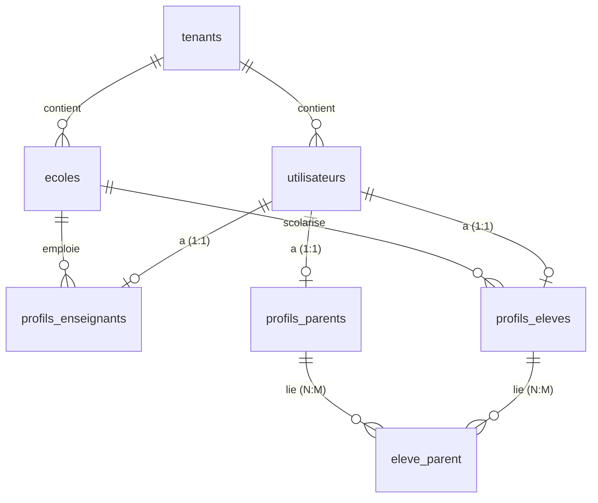

# Gestion des Utilisateurs, Administration et Évolution des Rôles (Scholaris)

Ce document détaille l'architecture, la gestion des privilèges, les limitations d'accès, les cinématiques d'évolution des rôles et le fonctionnement du multi-tenant dans **Scholaris**.

---

## 1. Modèle Conceptuel et Isolation Multi-Tenant

Scholaris utilise une architecture **multi-tenant** pour isoler les données de chaque établissement (rattachées à un `tenant_id`). L'espace public global (forum) est accessible sous le tenant de réserve nommé `public`.



### Rôles de Sécurité (`utilisateurs.role`)
*   **`user`** : Utilisateur standard. Accès uniquement au forum.
*   **`parent`** : Parent d'élève. Suivi scolaire (notes, bulletins, finances) des enfants.
*   **`enseignant`** : Pédagogue de l'école (notes, absences, emploi du temps).
*   **`admin_ecole`** : Administrateur système d'un établissement spécifique.
*   **`super_admin`** : Administrateur global de la plateforme SaaS.

---

## 2. Rôle et Fonctionnement du Sous-domaine

Dans une application SaaS multi-tenant comme Scholaris, le **sous-domaine** (ex: `college-laureats.academiatrack.cm`) est le point d'entrée technique et fonctionnel de chaque établissement.

### A. Pourquoi a-t-on besoin d'un sous-domaine ?
1.  **Isolation des Requêtes** : Lorsque l'application s'exécute dans le navigateur, elle doit savoir avec quelle base de données (quel établissement) elle communique. Le sous-domaine présent dans l'URL du navigateur sert de clé d'identification.
2.  **Rattachement Contextuel** : Lors de chaque appel vers le serveur (API), le frontend extrait le sous-domaine de l'URL et l'envoie. Le backend résout ce sous-domaine pour récupérer le `tenant_id` correspondant, filtrant ainsi les requêtes SQL (Prisma) pour ne renvoyer que les élèves, classes, notes et factures de cet établissement précis.
3.  **Personnalisation Graphique** : Le fait d'avoir un sous-domaine permet d'afficher une page de connexion personnalisée aux couleurs de l'école, affichant son propre nom et son logo officiel.
4.  **Bascule Transparente** : Si un utilisateur possède des rôles ou des enfants dans plusieurs écoles, la navigation d'un établissement à un autre s'effectue en orientant simplement le navigateur vers le sous-domaine concerné.

### B. Génération du sous-domaine lors de la création d'école
L'utilisateur saisit le nom de l'école (ex: `Collège Les Lauréats`).
*   Le système nettoie automatiquement ce nom (slugification) : retrait des accents, mise en minuscules, remplacement des caractères spéciaux et espaces par des tirets.
*   Il obtient un sous-domaine propre : `college-les-laureats`.
*   Si ce sous-domaine est déjà pris par un autre établissement en base de données, un numéro aléatoire à 4 chiffres est concaténé à la fin (ex: `college-les-laureats-5829`) pour garantir l'unicité absolue.

---

## 3. Inscription Initiale et Restrictions (Plan Standard)

À l'inscription sur la page d'accueil de la plateforme, l'utilisateur s'enregistre en tant qu'utilisateur simple (`user`).

### A. Génération des Paramètres de Base
*   **Tenant d'accueil** : L'utilisateur est lié au tenant `public`.
*   **Pseudo généré** : Un pseudonyme aléatoire et anonyme est défini sous la forme `user_${adjectif}_${nombre}`.
*   **Avatar** : Un avatar initial est créé via l'API publique DiceBear en utilisant le pseudonyme comme graine de génération (*seed*).
*   **Profil** : Un enregistrement `profils_parents` par défaut est automatiquement lié à son compte `utilisateurs`.
*   **Routage** : L'utilisateur est automatiquement redirigé vers l'espace forum `/user/feed` dès sa connexion.

### B. Visuels de la Page de Connexion / Inscription
Les pages de connexion (`LoginPage.tsx`) et d'inscription (`RegisterPage.tsx`) intègrent à gauche un panneau visuel commun (`RegisterLeftPanel.tsx`) :
*   **Format d'images** : Diaporama occupant tout l'arrière-plan de la colonne gauche (format natif 9:16), sans floutage, pour préserver la netteté de l'image.
*   **Titres uniques par image** : Un unique titre en blanc de taille généreuse est positionné en surimpression au premier plan :
    1.  Illustration 1 (`loginsetp1.png`) : *"Une éducation plus forte commence par des familles impliquées."*
    2.  Illustration 2 (`loginsetp2.png`) : *"Un espace d'échange pour toute la communauté scolaire."*
    3.  Illustration 3 (`loginsetp3.png`) : *"Suivez la scolarité de votre enfant en temps réel."*
*   **Branding épuré** : Les mentions de nom d'école, logo en haut ou année de copyright en bas de page sont supprimés pour maximiser la visibilité de l'image et du titre.

### C. Restrictions d'Édition du Pseudo & Avatar
> [!IMPORTANT]
> Les utilisateurs de rôle `user` (plan gratuit/forum) ne sont pas autorisés à modifier leur pseudonyme ni leur avatar.
*   **Interface (Frontend)** : Le bouton de modification d'avatar est masqué et remplacé par le message : **"Pour modifier votre pseudo ou votre avatar, veuillez passer à un plan supérieur."**
*   **Contrôle API (Backend)** : Si un utilisateur standard tente d'envoyer des valeurs pour `username` ou `photo_url` aux routes `/api/parents/profile` ou `/api/settings/profile`, le serveur rejette immédiatement la requête avec une erreur `400 Bad Request`.

---

## 4. Parcours Parent : Devenir Parent et Rétrogradation

La promotion et la rétrogradation de l'interface parent sont entièrement gérées de manière dynamique sur la base de la présence d'enfants rattachés au compte.

### A. Promotion automatique vers Parent
*   **Liaison** : Lorsqu'un administrateur d'école enregistre un élève en renseignant l'email de son tuteur, le backend lie l'élève au profil de l'utilisateur via la table de jointure `eleve_parent`. Si le compte parent n'existait pas, un accès avec mot de passe temporaire est créé. Si l'utilisateur avait le rôle de base `user`, son rôle est mis à jour à `parent`.
*   **Détection automatique** : Lors de la connexion, le tableau de bord vérifie si l'utilisateur possède au moins un enfant associé (`children.length > 0`). Si c'est le cas et qu'il navigue sur `/user`, le système le **redirige automatiquement vers l'espace parent (`/parent`)**, activant le menu "Vue d'ensemble", l'affichage des notes, bulletins et contributions financières.

### B. Perte des liaisons (Retour à `user`)
*   Si le parent n'a plus d'enfants inscrits actifs dans aucun établissement :
    1.  Le système le détecte (`children.length === 0`).
    2.  Le tableau de bord parent le redirige automatiquement vers le flux utilisateur classique (`/user/feed`).
    3.  L'accès aux onglets de la vue d'ensemble parent (bulletins, finances) est désactivé, faisant repasser son expérience utilisateur en mode `user` (simple membre du forum public sous `UserDashboard`).

---

## 5. Parcours Enseignant et Cumul de Rôles

### A. Ajout ou Promotion d'un Enseignant
Lorsqu'un administrateur ajoute un professeur :
1.  **Vérification Locale/Globale** :
    *   Si l'email existe déjà dans l'établissement, le système refuse pour doublon.
    *   Si l'email existe **déjà globalement** sur un autre tenant ou en tant que simple `user` / `parent` :
        *   Le mot de passe actuel de l'utilisateur est conservé. Aucun mot de passe temporaire ne lui est créé ni renvoyé.
        *   Un email d'information simple lui est envoyé.
        *   **Copie du Profil** : Son âge (`age`) et son genre (`sexe`) enregistrés sur ses autres profils sont recopiés dans son nouveau profil d'enseignant pour lui éviter de les ressaisir.
    *   S'il n'existe pas du tout, un mot de passe temporaire de 8 caractères hexadécimaux lui est généré et envoyé par mail.
2.  **Identifiants d'Enseignant** :
    *   **Matricule unique** : Format `ENS{code_ecole}{année}{séquence}`.
    *   **Pseudo** : Format `prof/{nom}-{prenom}`.
    *   **Avatar** : Un fichier SVG est créé localement sous `/uploads/avatar_ENS{matricule}_{random}.svg`.
3.  **Complétude du Profil** : Si le profil enseignant (ou parent) créé n'a pas d'âge ni de sexe renseignés (cas d'un compte créé à partir de zéro), l'accès à son espace de travail est verrouillé par un écran bloquant `ForceProfileConfigModal` tant que ces champs ne sont pas saisis.

### B. Cumul Enseignant et Parent (Vue Intégrée)
Si un enseignant possède un ou plusieurs enfants inscrits sur la plateforme :
*   Il conserve son rôle d'accès global **`enseignant`** et son interface de cours.
*   Le menu de gauche affiche une option **"Espace Parent"** (route `/prof/parent`).
*   Cette option affiche le composant **`TeacherParentView`** directement au sein de sa mise en page d'enseignant. Il peut choisir l'enfant à suivre via un menu déroulant et visualiser ses notes, bulletins et contributions financières sans basculer de rôle ni changer de tableau de bord.

---

## 6. Création d'un Établissement (Promotion `admin_ecole`)

Un utilisateur standard possède un **espace de travail dédié** dans `/src/pages/user/UserDashboard.tsx` (avec sa propre barre latérale `UserSidebar` et son en-tête `UserHeader`). Cette architecture isole complètement l'expérience utilisateur standard du code complexe parent, maximisant les performances, la légèreté et la maintenabilité à grande échelle.

L'utilisateur se connecte directement sur le forum public (`/user/feed`). Pour créer son école, il dispose d'un bouton **"Créer un établissement"** dans le menu contextuel (popup) de son profil en haut à droite. Cliquer sur ce bouton ouvre un modal moderne contenant le formulaire d'établissement. Cette opération nécessite une confirmation par email (OTP) :

```
[Menu Profil > Créer Établissement] ---> [Ouverture Modal] ---> [Saisie Infos] ---> [Envoi OTP]
                                                                                          |
[Vérification OTP dans Modal] <-----------------------------------------------------------+
            |
            v
[OTP Valide : Création Tenant & École] ---> [Bascule JWT & Redirection vers /ecole-dashboard]
```

Le modal de création utilise la même charte visuelle scindée en deux colonnes que l'authentification :
*   **Colonne Gauche (Visuel)** : Image nette `loginsetp4.png` en arrière-plan (format natif 9:16), sans floutage, avec le grand titre blanc en surimpression au premier plan : *"Passez d'une gestion papier à une école 100 % digitale."* (sans en-tête ni copyright).
*   **Colonne Droite (Formulaire)** : Formulaire de configuration de l'établissement (`ParentSchoolUpgrade.tsx`).
*   **Verrouillage du Défilement** : Le défilement de l'arrière-plan de la page est automatiquement bloqué (`overflow: hidden` sur le `body`) lorsque le modal est ouvert pour éviter le double défilement. La barre de défilement interne du formulaire est masquée pour garantir une esthétique épurée.
*   **Retrait de l'espace Paramètres** : Le formulaire de création d'école a été totalement retiré de la page des paramètres (`ParentSettings.tsx`). Le parcours de création s'effectue désormais exclusivement à travers ce modal dédié ouvert depuis le menu de profil.

### A. Formulaire de Configuration (Sans champ de sous-domaine)
Le formulaire affiché dans le modal ne contient aucun champ de saisie de sous-domaine (déduit automatiquement). Il capture :
1.  **Nom de l'établissement** (Requis).
2.  **Nom du dirigeant / Directeur** (Requis, découpé en nom/prenom pour le profil).
3.  **E-mail officiel de l'école** (Optionnel, valeur par défaut : email de l'utilisateur).
4.  **Numéro de téléphone** (Optionnel, enregistré dans `ecoles.telephone`).
5.  **Logo de l'établissement** (Optionnel, téléversé via une zone interactive de glisser-déposer de fichier ou sélecteur d'image, enregistré dans `ecoles.logo_url`).

### B. Validation par Code OTP (Upgrade Flow)
1.  **Étape 1 (Demande)** : La soumission du formulaire appelle `/api/auth/request-upgrade-otp`. Le serveur génère un code OTP à 6 chiffres, le lie à l'utilisateur (`otp_code` pour 10 min) et l'envoie à l'adresse e-mail de l'école.
2.  **Étape 2 (Vérification)** : L'utilisateur saisit le code reçu dans le modal. La validation appelle `/api/auth/verify-upgrade-otp` en transmettant le code OTP, le nom du dirigeant et les informations de l'établissement.
3.  **Étape 3 (Création)** : Si le code est correct, le serveur crée le `tenant`, l'`ecole` (avec le numéro de téléphone et le logo), promeut le rôle de l'utilisateur à `'admin_ecole'` et change son `tenant_id` (l'établissement n'a plus d'année scolaire créée automatiquement afin qu'il puisse la configurer lui-même).
4.  **Étape 4 (Bascule)** : L'utilisateur reçoit son nouveau token JWT. Le frontend actualise sa session via la méthode `login` du contexte d'authentification, ferme le modal et le redirige directement vers le tableau de bord d'administration (`/ecole-dashboard`).
5.  Son mot de passe de connexion initial reste inchangé (modifiable dans ses paramètres).

## 7. Personnalisation Dynamique du Profil École
Dans le tableau de bord d'administration (`/ecole-dashboard`), les informations de marque ont été rendues 100 % dynamiques :
*   **En-tête de Profil** : L'avatar en haut à droite affiche le logo de l'école (si défini) ou l'avatar générique par défaut.
*   **Menu Déroulant** : Cliquer sur l'avatar ouvre un menu affichant le nom officiel de l'établissement (e.g. *Collège Les Lauréats*) et l'adresse e-mail de connexion de l'administrateur, à la place de la mention statique démo.

## 8. Architecture du Forum Global
Pour favoriser l'interaction et la communauté éducative sur la plateforme :
*   **Pas de cloisonnement par école** : Le flux de discussion et de recherche du forum (`/api/forum/topics`) ne filtre pas les publications par `tenant_id`.
*   **Visibilité Universelle** : Tous les utilisateurs (visiteurs publics, parents, élèves, enseignants et administrateurs d'écoles) ont accès au même fil d'actualités global et peuvent voir, rechercher, aimer et commenter les publications de n'importe quel autre membre de la plateforme.

## 9. Système de Cascade Récursive des Commentaires
Pour assurer une vraie navigation en arborescence de type forum communautaire (Reddit-style) :
*   **Structure en Arbre** : Les réponses plates sont converties côté client en nœuds imbriqués basés sur leur lien `reponse_parent_id`.
*   **Cascade d'Indentation** : Les réponses à des réponses sont décalées vers la droite avec une marge interne (`pl-6 border-l ml-3`), matérialisant clairement le fil conducteur.
*   **Bouton Répondre par Commentaire** : Chaque commentaire imbriqué possède son propre bouton permettant d'écrire une réponse sous-jacente. L'ID du commentaire parent est transmis au backend pour conserver la liaison hiérarchique en base de données.

## 10. Optimisations UX et Organisation des Filtres / Sidebars
*   **Likes dynamiques non-mockés** : Le compteur d'avis sur les nouveaux commentaires débute à `0`. Pour les anciens commentaires, un algorithme déterministe attribue un nombre stable de likes basé sur le hash de leur ID (UUID), évitant le rafraîchissement aléatoire ou les `4 likes` systématiques lors de l'envoi d'un nouveau message.
*   **Boutons de chargement isolés** : La soumission d'une réponse imbriquée n'active que le spinner local du formulaire cliqué. L'état global `sending` est exclusivement réservé au formulaire de publication racine pour éviter de bloquer l'interface.
*   **Protection anti-double envoi** : L'état `sending` est doublement vérifié à la soumission du formulaire pour bloquer tout clic ou touche Entrée répétitive, empêchant la création de doublons en base.
*   **Raccourcis dans la Sidebar Latérale Gauche** : Deux onglets indépendants (**« Populaire »** et **« Nouveau »**) ont été ajoutés sur la barre de navigation gauche (au même niveau, de même taille et de même importance visuelle que **« Feed »**). Cliquer dessus redirige vers le flux correspondant via les paramètres de l'URL (`?sortBy=best` ou `?sortBy=new`).
*   **Restauration de la Sidebar Droite (Publications Récentes)** : Le panneau latéral droit affiche à nouveau une carte unique titrée **« Publications Récentes »** présentant les **10 publications les plus récentes publiées au cours des dernières 24 heures**.
